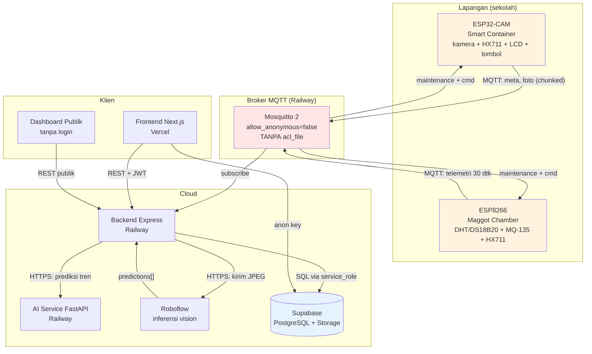

# Audit Kesiapan Produksi — MBGCircular SPPG MBG

**Tanggal audit:** 20 September 2026
**Cakupan:** seluruh sistem yang **aktif di produksi** — frontend Vercel, backend Railway, database Supabase, inferensi Roboflow, broker Mosquitto, dan firmware ESP32-CAM + ESP8266.
**Sifat:** audit berbasis bukti kode dan data. Semua temuan menyertakan `file:line` atau keluaran perintah.
**Konteks penting:** sistem **sudah live**, sehingga temuan di sini bermakna **risiko produksi aktif**, bukan penghambat go-live.

**Dokumen pendukung:**
- `docs/AUDIT_INTEGRITAS_DATA.md` — audit data produksi (temuan kuantitatif)
- `docs/LAPORAN_PENGUKURAN_PAPER.md` — hasil pengukuran latency
- `docs/WEIGHT_ESTIMATION_DESIGN.md` — desain estimasi berat
- `docs/PUBLIC_DASHBOARD_PLAN.md` — rencana dashboard
- `docs/VALIDASI_PENGUJIAN.md` — protokol validasi

**Catatan cakupan:** proyek ini **sengaja dirancang untuk satu sekolah**, bukan multi-tenant. Ketidakadaan isolasi per sekolah **bukan temuan** dan tidak masuk roadmap. Namun kolom warisan `sekolah_id` yang masih ada tetap dicatat sebagai temuan kebersihan skema.

---

## A. Ringkasan Eksekutif

### A.1 Kesimpulan utama

Sistem MBGCircular **berfungsi secara fungsional** — rantai data dari perangkat hingga database terbukti hidup, penjadwalan telemetri tepat (p50 = 30,0 detik), dan semua layanan merespons. Namun sistem **belum layak disebut production-grade** karena tiga alasan struktural:

1. **Data tidak memiliki provenance.** Tidak ada cara membedakan data nyata dari data simulasi setelah tersimpan. Ini masalah paling mendasar: tanpa provenance, tidak ada angka yang dapat diaudit, dan semua klaim kinerja kehilangan dasar. *(Sebagian sudah diperbaiki di kode; migrasi database belum dijalankan.)*

2. **Kredensial perangkat bocor dan kanal perintah tidak terautentikasi.** WiFi PSK, kredensial MQTT, dan kunci perangkat pernah tersimpan di source dan dokumentasi yang di-commit. Broker tidak memiliki ACL, sehingga satu kredensial dapat mengendalikan **semua** perangkat — termasuk `set_scale_factor` (memanipulasi berat panen) dan `reboot`.

3. **Tidak ada observability maupun pengujian otomatis.** Tidak ada logging terstruktur, metrics, tracing, error tracking, health-check dependensi, CI/CD, atau test. Kegagalan hanya terdeteksi bila ada yang kebetulan melihat.

### A.2 Status perbaikan dalam siklus audit ini

| Perbaikan | Status | Verifikasi |
|---|---|---|
| Provenance data + isolasi mode mock | ✅ kode selesai, ⏳ migrasi belum dijalankan | 31 test lulus |
| Validasi menolak sesi 0 kg & telemetri null | ✅ selesai | test `processChamber` lulus |
| Label minggu menyertakan tahun | ✅ selesai | tervalidasi terhadap data produksi (`Minggu 38` → `2026-M38`) |
| CORS allowlist eksplisit | ✅ selesai | diuji: `attacker.vercel.app` ditolak, tanpa header CORS |
| `deviceAuth` fail-closed | ✅ selesai | 503 di produksi bila kunci kosong |
| Kredensial firmware → `secrets.h` | ✅ selesai | **kedua firmware terkompilasi bersih** |
| Sanitasi kredensial di dokumentasi | ✅ selesai | pemeriksaan grep CI bersih |
| CI + test suite | ✅ selesai | 31 test lulus, workflow 3 job |
| **Next.js 14.2.5 → 15.5.24 + React 19** | ✅ selesai | critical 1 → 0; build + runtime terverifikasi |
| **Observability, health-check dependensi, graceful shutdown** | ✅ selesai | diuji dengan SIGTERM sungguhan |
| **State pemeliharaan & demo ke database** | ✅ kode selesai, ⏳ migrasi belum dijalankan | 31 test lulus; hidrasi saat startup |
| **Agregasi SQL + endpoint publik baru** | ✅ kode selesai, ⏳ migrasi belum dijalankan | jalur cadangan berlapis diuji terhadap DB produksi |
| **ESLint + Prettier** | ✅ selesai | lint 0 error |
| **Perbaikan pemuatan `.env`** | ✅ selesai | terbukti: `[env] berkas dimuat: ../.env (akar repo)` |
| Rotasi kredensial yang bocor | ❌ **belum** | butuh jendela deploy + reflash |
| ACL Mosquitto / TLS / perintah bertanda tangan | ❌ **belum** | butuh perubahan broker + firmware |

---

### A.3 Koreksi temuan (penting — menggantikan rekomendasi awal)

Rekomendasi awal untuk kerentanan Next.js adalah naik ke versi patch `14.2.35`. **Itu keliru, dan sudah dikoreksi setelah diverifikasi.**

`npm audit` melaporkan versi yang terpasang, bukan versi yang disarankan perbaikan. Setelah `next` dinaikkan ke `14.2.35`, audit **masih** melaporkan 1 critical. Pemeriksaan rentang rentan menunjukkan sebabnya:

| Advisory | Severity | Rentang rentan | Apakah `14.2.35` termasuk? |
|---|---|---|---|
| `GHSA-2xp9-vwfh-vxw4` — RCE di Image Optimization API | **critical** | `>=10.0.0 <15.5.24` | **Ya** |
| `GHSA-p293-qw3h-jr36` — RCE pada server Windows | **critical** | `>=13.4.0 <15.5.24` | **Ya** |
| `GHSA-89xv-2m56-2m9x` — SSRF di Server Actions | high | `>=14.1.1 <15.5.21` | **Ya** |

**Kesimpulan yang benar:** kerentanan critical hanya dapat ditutup dengan **lompatan mayor**, bukan patch. Target yang dipilih: **`next@15.5.24` + React 19**.

**Hasil verifikasi (bukan asumsi):**

| Uji | Hasil |
|---|---|
| `npm audit` sesudah upgrade | **critical 1 → 0** |
| `npm run build` | ✅ sukses, 12/12 halaman ter-prerender |
| Perubahan kode yang diperlukan | **tidak ada** |
| `next start` runtime | ✅ HTTP 200 pada `/`, `/login`, `/admin-sekolah`, `/dapur-mbg`, `/superadmin` |
| Konten ter-render | ✅ teks halaman utama dan navbar muncul |

**Sisa setelah upgrade:** 1 moderate (Next.js) dan 1 high (postcss). Yang high berasal dari `postcss@8.4.31` yang **dibundel di dalam Next.js** — bukan dari dependensi langsung (proyek sudah memakai `postcss@8.5.28`). PostCSS hanya dipakai saat build dan **tidak pernah ada di runtime browser**, sehingga paparan sebenarnya rendah. Menutupnya sepenuhnya memerlukan `next@16.3.5` (breaking).

**Konsekuensi yang harus dicatat:** ukuran *First Load JS* bersama naik dari **87,3 kB → 102 kB** (+14,7 kB), konsekuensi runtime React 19. Ini perlu dipertimbangkan bila target optimasi adalah jaringan sekolah yang lambat; mitigasinya adalah pemecahan bundel dan `next/font`, bukan menunda perbaikan keamanan.

---

## B. Arsitektur & Alur Data

### B.1 Diagram arsitektur (kondisi nyata)



**Perhatian pada diagram:** kotak merah (Mosquitto) menandai titik terlemah — tanpa ACL dan tanpa TLS. Kotak oranye menandai perangkat yang menyimpan kredensial di firmware.

> **Catatan:** `frontend/lib/supabaseClient.js` ada tetapi **tidak diimpor di mana pun** — panah `FE --> SB` tidak benar-benar dipakai. Ini dead code.

### B.2 Alur data detail (jalur yang benar-benar berjalan)

**Jalur A — Smart Container (foto + berat) via MQTT:**
```
Tombol ditekan
  → ESP32-CAM: state machine STATE_DUMP, tunggu stabil 1500 ms
  → publish mbg/smart-container/meta   {"beratKg": x}
  → publish mbg/smart-container/foto   (JPEG per-chunk, 1024 B/chunk, buffer 4096 B)
  → Backend (mqtt.js:97-103): ambil beratKg dari cache (berlaku 30 detik)
  → processSmartContainer() → Roboflow → bagi berat per kelas
  → insert waste_records (+ provenance)
  → publish mbg/smart-container/result
  → ESP32-CAM: LCD "Selesai! Terima Kasih"
```

**Jalur B — Maggot Chamber (telemetri sensor):**
```
ESP8266 tiap 30 detik
  → publish mbg/maggot-chamber  {suhuBilikC, kelembapanPersen, kadarAmoniaPpm, suhuSubstratC, beratMaggotPanenKg}
  → Backend (mqtt.js:105-117): processChamber()
  → insert sensor_readings
  → publish mbg/maggot-chamber/result  {aman, rekomendasi}
```
**Kondisi terverifikasi:** 32 baris tersimpan, jeda p50 = 30,0 detik, **namun seluruh nilai sensor null** — lihat `docs/AUDIT_INTEGRITAS_DATA.md` §C.3.

**Jalur C — REST (fallback):** `POST /api/iot/smart-container` dan `POST /api/iot/maggot-chamber` (`iot.js:13,27`), dilindungi `x-device-api-key`.

### B.3 Trust boundary dan status autentikasinya

| Batas kepercayaan | Mekanisme | Status | Catatan |
|---|---|---|---|
| Klien → Backend (manusia) | JWT bearer, 8 jam | ⚠ | Tidak ada refresh/revocation; disimpan di `localStorage` |
| Klien → Backend (publik) | tidak ada | ✅ | Hanya baca agregat — sesuai desain |
| Perangkat → Backend (REST) | `x-device-api-key` | ✅ diperbaiki | Sebelumnya **fail-open** bila kunci kosong |
| Perangkat → Broker (MQTT) | username/password tunggal | ❌ | **Tanpa ACL**; satu kredensial untuk semua perangkat |
| Backend → Broker | kredensial yang sama | ❌ | Sama dengan di atas |
| Broker → Perangkat (perintah) | **tidak ada** | ❌ | Perangkat menerima perintah dari publisher mana pun |
| Backend → Supabase | `service_role` key | ⚠ | Menembus RLS; RLS praktis tidak memberi perlindungan tambahan |
| Backend → Roboflow | API key di header | ✅ | Dilakukan server-side, tidak terekspos ke klien |

### B.4 Peta topik MQTT: kondisi vs yang seharusnya

| Topik | Arah | Kondisi | Yang seharusnya |
|---|---|---|---|
| `mbg/smart-container/meta` | perangkat → backend | ✅ | Tambah `sessionId` untuk korelasi dengan foto |
| `mbg/smart-container/foto` | perangkat → backend | ⚠ | QoS 0, chunked — hilang senyap bila putus |
| `mbg/smart-container/result` | backend → perangkat | ✅ | Tambah `cmdId` |
| `mbg/smart-container/cmd` | backend → perangkat | ❌ | **Tidak terautentikasi di sisi perangkat**, tanpa target perangkat |
| `mbg/maggot-chamber` | perangkat → backend | ⚠ | QoS 0, tanpa cap waktu |
| `mbg/maggot-chamber/result` | backend → perangkat | ✅ | — |
| `mbg/maggot-chamber/status` | perangkat → backend | ⚠ | **Backend hanya mendengar `cmd-result`**, bukan `status` → ACK tidak pernah sampai |
| `mbg/maintenance` | backend → perangkat | ❌ | Firmware **membuang** pesan retained ini saat connect (`smart_container_esp32cam.ino:540`) |

**Temuan integrasi (High):** ACK perangkat ESP8266 dipublikasikan ke `.../status`, sedangkan backend hanya berlangganan `.../cmd-result` (`backend/src/config/mqtt.js:74,134-138`). Akibatnya dashboard **tidak pernah** dapat menampilkan apakah perintah `tare`/`set_scale_factor` berhasil atau gagal. Kesalahan kalibrasi tidak akan terlihat sampai ada yang menyadari angka beratnya aneh.

---

## C. Temuan per Layer

### C.1 Frontend

| Layer | Severity | Bukti | Dampak | Rekomendasi | Effort | Prioritas |
|---|---|---|---|---|---|---|
| Frontend | ~~**Critical**~~ **SELESAI** | `frontend/package.json` sebelumnya `next: 14.2.5`; `npm audit` → 1 critical + 1 high (termasuk `GHSA-f82v-jwr5-mffw` middleware auth bypass, `GHSA-2xp9-vwfh-vxw4` RCE image optimization) | Kerentanan yang diketahui publik pada framework | **Sudah dinaikkan ke `next@15.5.24` + React 19.** Catatan penting: `14.2.35` TIDAK cukup — rentang rentan `GHSA-2xp9-vwfh-vxw4` adalah `<15.5.24`, sehingga hanya jalur mayor yang menutupnya. Build, prerender, dan runtime terverifikasi; tidak ada perubahan kode yang diperlukan | M | **SELESAI** |
| Frontend | High | Tidak ada `error.js`, `loading.js` di `frontend/app/` | Satu error komponen membuat halaman kosong tanpa pesan | **Selesai**: `app/error.js` + `app/loading.js` ditambahkan | S | **SELESAI** |
| Frontend | High | `lib/usePolling.js` — `setInterval` tanpa dedup/cancel; dua komponen memanggil `/devices` setiap 3 detik | Beban ganda; request menumpuk bila lambat | **Selesai**: timeout rekursif (tidak menumpuk) + dedup antar komponen + jeda saat tab tidak aktif | S | **SELESAI** |
| Frontend | **High** | Delapan tempat memakai `.catch(() => {})`, sehingga kegagalan pengambilan data tidak terlihat | **Berbahaya pada sistem timbangan**: nilai kosong/"0" yang tampak sah dapat disangka berarti "tidak ada sisa makanan", padahal artinya "data tidak termuat". Pada `MaintenanceModeToggle` lebih buruk lagi: bila GET status gagal, tombol menampilkan "Aktifkan" dan menekannya mengirim `{aktif:false}` — **kebalikan dari maksud operator** | **Selesai**: komponen `ErrorNotice` + hook `useMuatBanyak`; seluruh catch kosong dihapus. `MaintenanceModeToggle` kini **menonaktifkan tombol** selama status belum diketahui, dan `BatchManager` tidak lagi menyatakan "belum ada batch aktif" saat data gagal dimuat | M | **SELESAI** |
| Frontend | Medium | Endpoint publik dahulu memuat seluruh tabel lalu menjumlahkan di memori | Boros memori/CPU seiring data bertambah | **Selesai**: agregasi dipindahkan ke fungsi SQL (`get_public_waste_by_category`, `get_public_tren`, `get_public_kualitas_data`, `get_public_peringkat_kategori`) + jalur cadangan berlapis | M | **SELESAI** |
| Frontend | Medium | `styles/globals.css:1` `@import url(fonts.googleapis.com)` | Memblokir render; permintaan ke pihak ketiga | Ganti ke `next/font` | S | P2 |
| Frontend | Medium | Hanya warna untuk status (`SensorMonitor.js:56`, `DeviceStatusPanel.js:31-32`) | Tidak aksesibel (WCAG 1.4.1) | Tambahkan teks/ikon | S | P2 |
| Frontend | Medium | Input tanpa `<label>` terhubung | Sulit dipakai pembaca layar; placeholder hilang saat pengguna mengetik | **Selesai**: seluruh 13 input pada `login`, `BatchManager`, `SalesManager`, `MenuUploadForm` kini memakai `<label htmlFor>` + `autoComplete`/`min`/`step`, dan pesan galat memakai `role="alert"` | M | **SELESAI** |
| Frontend | Low | `lib/supabaseClient.js` tidak diimpor di mana pun | Dead code; kunci anon tidak perlu terekspos | Belum dihapus — masih terbuka | S | P3 |
| Frontend | Low | `AuthContext.js:22-23` token di `localStorage` | Rentan bila ada XSS; tidak dapat dicabut | Pertimbangkan cookie `httpOnly`, atau minimal perpendek masa berlaku + refresh | M | P2 |

### C.2 Backend / API

| Layer | Severity | Bukti | Dampak | Rekomendasi | Effort | Prioritas |
|---|---|---|---|---|---|---|
| Backend | **High** | `index.js` dahulu memanggil `dotenv.config()` tanpa argumen, sehingga hanya membaca `.env` di direktorat kerja. Karena dokumentasi menyuruh `cd backend && npm run dev`, berkas konfigurasi di **akar repo tidak pernah terbaca** | Backend berjalan **tanpa kredensial Supabase secara diam-diam**; dashboard menampilkan data contoh tanpa indikasi penyebabnya. Ditemukan saat pengujian endpoint publik putaran ini | **Diperbaiki**: `config/env.js` memuat `backend/.env` **dan** `../.env` (prioritas: env proses → `backend/.env` → akar repo), lalu mencetak ringkasan kunci yang terisi (tanpa nilainya) | S | **SELESAI** |
| Backend | High | `index.js:59` `express.json({ limit: '10mb' })` global, berlaku juga untuk endpoint IoT | Dapat dipakai menghabiskan memori | Batasi limit per route; endpoint IoT kini 256 KB | S | **SELESAI** |
| Backend | High | Tidak ada validasi skema di `iot.js:27` (`processChamber(req.body)` meneruskan body mentah) | Nilai liar (negatif, tak wajar) dapat masuk `sensor_readings` | **Selesai**: zod + `config/validasi.js`. Pemeriksaan "truthy" yang dahulu meloloskan `beratKg:"-5"` (menghasilkan total **negatif**) diganti skema sungguhan. Teruji via HTTP: 400 untuk nilai tidak sah, 422 untuk payload null | M | **SELESAI** |
| Backend | High | Tidak ada graceful shutdown | Setiap deploy memutus MQTT & request tanpa penyelesaian rapi | **Selesai**: handler `SIGTERM`/`SIGINT` + penutupan MQTT rapi + batas waktu 10 detik. **Diuji dengan sinyal sungguhan** | S | **SELESAI** |
| Backend | High | `/health` hanya `{status:'ok'}`, tanpa memeriksa dependensi | Orchestrator menganggap sehat walau database/MQTT mati | **Selesai**: `/health` (liveness) dipisah dari `/health/ready` (dependensi + **kesegaran data**) | S | **SELESAI** |
| Backend | High | Rate limit hanya untuk login & IoT; endpoint terberat tanpa batas | Penyalahgunaan endpoint berat; perintah perangkat yang dibanjiri dapat memicu reboot berulang & menguras umur EEPROM | **Selesai**: `config/rateLimit.js` — 20/menit untuk ekspor & AI, 30/menit untuk perintah perangkat. **Diuji**: 200×3 → 429, header `RateLimit` benar | S | **SELESAI** |
| Backend | Medium | Tidak ada security header | Kurang pertahanan terhadap XSS/clickjacking | **Selesai**: `helmet` terpasang; header terverifikasi pada respons | S | **SELESAI** |
| Backend | Medium | `PUT /:id/panen` tanpa kondisi status; dua permintaan bersamaan sama-sama sukses | Status batch dapat tidak konsisten | **Selesai**: kondisi `.neq('status','selesai_panen')` + 409 bila sudah dipanen; ID divalidasi UUID | S | **SELESAI** |
| Backend | Medium | `reports.js` memuat seluruh tabel; `toCsv` tanpa escaping | Memori meledak; **CSV injection** (nilai diawali `=` dieksekusi Excel); koma/kutip merusak berkas | **Selesai**: escaping penuh + netralisasi formula (`'` di depan) + filter periode + batas 50.000 baris + header `X-Data-Terpotong`. Diuji 15 test | M | **SELESAI** |
| Backend | Medium | Nama file upload memakai `req.file.originalname`; MIME tidak diverifikasi | Nama file berbahaya dapat masuk bucket publik (path traversal) | **Selesai**: nama file dibuat server (waktu + UUID + ekstensi dari MIME tervalidasi), MIME dibatasi JPEG/PNG/WebP, 415 bila tidak didukung | S | **SELESAI** |
| Backend | Medium | `aiService.js:60-62,101-103` mengembalikan `err.message` mentah ke klien | Membocorkan detail internal | Petakan ke pesan umum + catat detail di log | S | P2 |
| Backend | Medium | `node-cron` terpasang tetapi tidak dipakai | Dependensi tak terpakai menambah permukaan risiko | **Selesai**: dihapus | S | **SELESAI** |
| Backend | Low | Tidak ada versioning API (semua `/api/...` tanpa `/v1`) | Perubahan merusak sulit dikelola | Pertimbangkan `/api/v1` | M | P3 |

### C.3 Firmware & IoT

| Layer | Severity | Bukti | Dampak | Rekomendasi | Effort | Prioritas |
|---|---|---|---|---|---|---|
| Firmware | **Critical** | Kredensial WiFi/MQTT tersimpan di source & dokumen (sebelum perbaikan); broker tanpa `acl_file` (`deploy/mosquitto/mosquitto.conf`) | Siapa pun pemegang kredensial dapat mengendalikan semua perangkat | Rotasi kredensial + ACL per perangkat | M | **P0** |
| Firmware | **Critical** | Perangkat menerima perintah dari publisher mana pun: `smart_container_esp32cam.ino:481-516`, `maggot_chamber_esp8266.ino:202-264` | `set_scale_factor` memalsukan berat panen; `reboot` = DoS; `set_r0` memalsukan alarm amonia | Perintah bertanda tangan (HMAC + nonce) + topik per perangkat | L | **P0** |
| Firmware | **Critical** | Tidak ada TLS: `WiFiClient` pada port plaintext; tidak ada `WiFiClientSecure` di seluruh `firmware/` | Kredensial, foto, dan telemetri dapat disadap/diubah | TLS 8883 dengan CA ter-pin, atau mTLS per perangkat | L | **P0** |
| Firmware | High | Tidak ada OTA: `grep` untuk `ArduinoOTA|httpUpdate|Update.h` → kosong | Perbaikan & rotasi kredensial butuh kunjungan fisik ke tiap unit | Partisi OTA ganda + update bertanda tangan | L | P1 |
| Firmware | High | `smart_container_esp32cam.ino:285-287` `wait_ready_timeout` hanya untuk sampel pertama, lalu `get_units(5)` tanpa timeout | Load cell rusak/cabut membuat firmware menggantung sebelum MQTT dilayani | Baca non-blocking berbasis deadline + `esp_task_wdt` | M | P1 |
| Firmware | High | Tidak ada Last Will & Testament; QoS 0 di semua publish; status tidak retained | Perangkat mati tidak dapat dibedakan dari perangkat sepi | LWT + QoS 1 untuk telemetri + status retained | S | P1 |
| Firmware | High | `smart_container_esp32cam.ino:540` membuang pesan retained `maintenance` tepat setelah subscribe | Mode pemeliharaan tidak berlaku bila perangkat lebih dulu hidup | Jangan buang retained; terapkan isinya | S | P1 |
| Firmware | High | `maggot_chamber_esp8266.ino:110,120` hasil `EEPROM.commit()` diabaikan, tetapi `ok:true` selalu dipublikasikan | Perangkat melaporkan kalibrasi yang tidak tersimpan | Periksa hasil commit + baca balik | S | P1 |
| Firmware | High | ACK perangkat ke `.../status`, backend hanya dengar `.../cmd-result` (`mqtt.js:74,134-138`) | Operasi perintah tidak terkonfirmasi | Selaraskan topik ACK | S | P1 |
| Firmware | Medium | Tidak ada NTP (`configTime` tidak ada) dan tidak ada cap waktu di payload | Data tidak dapat diberi waktu absolut dari perangkat | Tambahkan NTP + `ts` di payload | S | P2 |
| Firmware | Medium | `maggot_chamber_esp8266.ino:464-468,170-187` `connectWifi` memblokir hingga 20 detik dan memanggil `WiFi.begin()` tiap loop | Perintah tertunda/hilang; keepalive 30 detik berisiko lewat | State machine non-blocking + backoff | M | P2 |
| Firmware | Medium | MQ-135 tanpa gerbang pemanasan (butuh 24-48 jam) | Pembacaan amonia tidak valid setelah reboot, tetapi tetap dikirim | Simpan status pemanasan di NVS, tandai belum siap | M | P2 |
| Backend | **High** | `sensorEvaluationService.js:2` dahulu memakai `Number(nilai)` tanpa memeriksa null. Karena `Number(null) === 0`, sensor yang **tidak terbaca** dinilai sebagai 0 °C / 0 % | Sistem mengeluarkan rekomendasi **palsu**: "Suhu bilik terlalu dingin", "Kelembaban saat ini 0%", padahal tidak ada data sama sekali. Ditemukan saat pengujian validasi putaran ini | **Diperbaiki**: nilai `null`/`undefined`/string kosong dikembalikan sebagai null dan tidak ikut dinilai. Nilai `0` yang asli tetap dinilai (0 °C memang dingin). Dikunci 3 test regresi | S | **SELESAI** |
| Firmware | Medium | Kode prod & test duplikat ~85-90% dan sudah berbeda (`RESULT_TIMEOUT_MS` 15000 vs 20000) | Perbaikan harus diterapkan dua kali; "yang diuji" bukan "yang dipakai" | Ekstrak pustaka bersama | L | P2 |
| Firmware | Medium | Tidak ada `platformio.ini`/manifest dependensi; versi pustaka tidak dipatok | Build tidak reprodusibel | Tambahkan manifest + CI kompilasi | M | P2 |
| Firmware | Low | Nilai status berat terakhir dipakai ulang saat HX711 gagal (`smart_container_esp32cam.ino:633-635`) tanpa penanda | Data beku tampak seperti data hidup | Kirim `sensorOk`/`readingAgeMs` | S | P2 |

### C.4 Database

| Layer | Severity | Bukti | Dampak | Rekomendasi | Effort | Prioritas |
|---|---|---|---|---|---|---|
| Database | **Critical** | Tidak ada kolom provenance; `schema.sql:78-87` `get_public_kpi()` menjumlahkan tanpa filter | Data simulasi tercampur & tidak dapat dipisahkan | Migrasi provenance (sudah disiapkan) + filter KPI | S | **P0** |
| Database | High | 90% baris `berat_kg = 0` direkam sebagai hasil sah (54/60 baris) | KPI & ranking terdistorsi | Tolak sesi tanpa nilai valid (sudah di kode) | S | **P0** |
| Database | High | Kolom `sekolah_id` masih ada di 6 tabel, seluruhnya `null` | Ambiguitas skema (menyiratkan multi-tenant) | Migrasi hapus kolom (terpisah, dengan rollback) | S | P1 |
| Database | Medium | Tidak ada constraint rentang pada kolom sensor | Nilai tak masuk akal dapat tersimpan | Constraint `check` pada rentang wajar | S | P1 |
| Database | Medium | Tidak ada `unique` pada `maggot_batches.batch_kode` | Kode batch ganda dapat lolos | Tambahkan unique + validasi | S | P2 |
| Database | Medium | Migrasi dijalankan manual tanpa tabel versi | Versi skema aktif tidak terlacak (audit ini sendiri menemukan skema tertinggal) | **Selesai**: `schema_migrations` + bootstrap; setiap migrasi mencatatkan versinya. **Sisa tindakan Anda:** jalankan migrasinya | M | **SELESAI (kode)** |
| Database | **High** | Deteksi "tabel belum ada" memakai pola `/relation\|does not exist\|42P01/i` yang **tidak pernah cocok**: backend memakai PostgREST yang mengembalikan kode **`PGRST205`** dengan pesan "Could not find the table … in the schema cache" | Seluruh pesan panduan "jalankan migrasi …" tidak pernah muncul; endpoint mengembalikan **500** (kesalahan server) padahal seharusnya **503** (konfigurasi belum lengkap); penanda "tabel tidak tersedia" tidak pernah aktif sehingga sistem mengulang query yang sama. Terjadi di `auditTrail.js` dan `routes/audit.js` | **Selesai**: detektor terpusat `config/dbError.js` (kode `PGRST205`/`PGRST202`/`42P01`/`42883`/`42703` + pola pesan), diuji 11 kasus termasuk **penolakan positif palsu** (duplikat, izin, validasi) | S | **SELESAI** |
| Database | Medium | Tidak ada audit trail perubahan data (siapa mengubah apa) | Sulit menelusuri perubahan | Tambahkan tabel audit atau trigger | M | P2 |
| Database | Medium | Backup/restore belum pernah diuji | Kehilangan data tidak terjamin dapat dipulihkan | Uji restore ke project sementara | M | P1 |
| Database | Low | RLS aktif tetapi hanya policy `service_role` | Backend menembus RLS, jadi RLS tidak menambah perlindungan | Dokumentasikan bahwa RLS bukan kontrol utama; jangan pernah pakai anon key untuk tulis | S | P3 |
| Database | Low | Faktor emisi `0,52` tanpa rujukan (`schema.sql:85`) | Angka lingkungan publik tidak dapat diverifikasi | Beri sumber atau tandai estimasi | S | P2 |

### C.5 Infrastruktur & DevOps

| Layer | Severity | Bukti | Dampak | Rekomendasi | Effort | Prioritas |
|---|---|---|---|---|---|---|
| Infra | High | Tidak ada CI/CD sebelum audit ini; tidak ada `.github/` | Regresi hanya terdeteksi setelah deploy | CI sudah dibuat; tambahkan deploy staging | M | P1 |
| Infra | High | Tidak ada lingkungan staging; pengujian langsung ke produksi | Perubahan berisiko menyentuh data nyata | Tambahkan project Supabase + service staging | M | P1 |
| Infra | High | Kredensial produksi ada sebagai file di disk (`.env`, `deploy/.env`, `ENV_VARIABLES.txt`) | Risiko kebocoran bila mesin dikompromikan | Pindahkan ke secret manager; putar ulang | M | P1 |
| Infra | Medium | `maintenanceMode` & `demoMode` adalah state in-memory (`config/maintenanceMode.js`, `config/demoMode.js`) | Hilang saat redeploy; **rusak bila replika > 1** → tidak dapat di-scale | Simpan di tabel `system_state` | M | P1 |
| Infra | Medium | `docker-compose.prod.yml` tidak menetapkan user non-root | Container berjalan sebagai root | Tambahkan `user` + turunkan hak | S | P2 |
| Infra | Medium | `.dockerignore` root tidak mengecualikan `backend/node_modules`/`frontend` | Konteks build besar & lambat | Perluas `.dockerignore` | S | P3 |
| Infra | Medium | Free tier Railway/Supabase; backend memakai sticky network untuk MQTT | Batas kuota & perilaku restart dapat memutus MQTT | Siapkan rencana kapasitas berbiaya | M | P2 |
| Infra | Low | `deploy/Caddyfile` memakai `api.example.com` placeholder | Jalur VPS tidak siap dipakai apa adanya | Isi domain atau tandai tidak aktif | S | P3 |

### C.6 Keamanan

| Layer | Severity | Bukti | Dampak | Rekomendasi | Effort | Prioritas |
|---|---|---|---|---|---|---|
| Keamanan | **Critical** | Kredensial bocor di riwayat git & dokumen (WiFi, MQTT, device key, password akun produksi) | Akses tidak sah ke perangkat, broker, dan akun | **Rotasi semua** + bersihkan riwayat | M | **P0** |
| Keamanan | **Critical** | Broker tanpa `acl_file`; satu user `mg_device` untuk semua topik & perangkat | Satu kebocoran = kendali penuh armada | ACL per perangkat + kredensial unik per unit | L | **P0** |
| Keamanan | High | AI service **tanpa autentikasi** dan diekspos publik (`aimbgcircular-b657.up.railway.app`) | Siapa pun dapat memakai sumber daya komputasi | **Selesai**: shared-secret `X-Internal-Key` + `AI_REQUIRE_AUTH` untuk menolak start bila kunci belum diatur. Rollout aman dengan mode transisi. Diuji 9 unit + 6 integrasi HTTP. **Sisa tindakan Anda:** isi `AI_INTERNAL_KEY` acak yang sama di AI service dan backend, lalu set `AI_REQUIRE_AUTH=true` | S | **SELESAI (kode)** |
| Keamanan | High | `JWT_SECRET` pernah bernilai lemah (`fazil`) di `.env` | Token dapat dipalsukan | Pastikan nilai produksi acak ≥ 32 byte; putar ulang | S | P1 |
| Keamanan | High | Token JWT 8 jam tanpa refresh/revocation (`routes/auth.js:54-58`) | Token yang bocor berlaku lama dan tidak dapat dicabut | Perpendek masa berlaku + mekanisme refresh/revocation | M | P2 |
| Keamanan | Medium | `/api/auth/demo-accounts` publik (`routes/auth.js:63-65`) membocorkan kredensial demo | Menambah permukaan serangan bila demo aktif di produksi | Nonaktifkan di produksi | S | P2 |
| Keamanan | Medium | `seed_prod_users.sql:8-11` memuat hash kata sandi default yang juga dipublikasikan di dokumentasi | Akun produksi dapat diprediksi | Rotasi + hapus dari dokumen (sebagian sudah diperbaiki) | S | **P0** |
| Keamanan | Medium | Tindakan operator (perintah perangkat, panen, mode demo/pemeliharaan) tanpa jejak audit | Tidak dapat membedakan tindakan operator dari gangguan perangkat ketika angka berubah atau perangkat reboot sendiri | **Selesai**: tabel `audit_log` (hanya-tambah) + `config/auditTrail.js` + endpoint `GET /api/audit` (superadmin). Penyensoran kredensial otomatis; **kegagalan audit tidak pernah menggagalkan operasi utama** (diuji) | M | **SELESAI (kode)** |
| Keamanan | Medium | Tidak ada security header (helmet) | Kurang pertahanan klien | Tambahkan `helmet` | S | P2 |
| Keamanan | Low | Tidak ada kebijakan retensi citra (UU PDP No. 27/2022) | Risiko kepatuhan | Tetapkan kebijakan + hapus otomatis | M | P1 |

### C.7 Observability & SRE

| Layer | Severity | Bukti | Dampak | Rekomendasi | Effort | Prioritas |
|---|---|---|---|---|---|---|
| Observability | High | Tidak ada logging terstruktur (`console.log`/`console.error` tersebar) | Log tidak dapat dicari/diagregasi | Log JSON + request-id | M | P1 |
| Observability | High | Tidak ada metrics, tracing, maupun error tracking | Kegagalan tidak terdeteksi sampai ada laporan | Tambahkan error tracking + metrics dasar | M | P1 |
| Observability | High | Tidak ada alerting: perangkat offline, inferensi gagal berulang, telemetri kosong tidak memicu notifikasi | Insiden berjalan tanpa diketahui (bukti: 32 baris telemetri kosong & 54 baris nol tidak terdeteksi) | Aturan alert pada kondisi nyata | M | P1 |
| Observability | Medium | Tidak ada instrumentasi durasi per tahap | Klaim latency tidak dapat dibuktikan dari data | **Selesai**: `latencyTrace.js` + endpoint `GET /api/kinerja` (khusus superadmin). Teruji: rantai telemetri = **924 ms** (n=1), seluruhnya habis di database | S | **SELESAI** |
| Observability | Medium | Tidak ada SLO/SLI yang ditetapkan | Tidak ada dasar untuk menilai sehat/tidak | Tetapkan SLO dasar | S | P2 |
| Observability | Low | Tidak ada uptime check eksternal | Gangguan hanya diketahui dari pengguna | Tambahkan monitor eksternal | S | P2 |

### C.8 Kualitas & Maintainability

| Layer | Severity | Bukti | Dampak | Rekomendasi | Effort | Prioritas |
|---|---|---|---|---|---|---|
| Kualitas | High | Tidak ada test sebelum audit ini (0 berkas uji) | Regresi tidak terdeteksi | Suite dasar sudah dibuat (16 test) | M | P1 |
| Kualitas | Medium | Tidak ada ESLint/Prettier/Ruff | Gaya kode tidak konsisten; bug umum tidak tertangkap | Tambahkan konfigurasi + jalankan di CI | S | P1 |
| Kualitas | Medium | Tidak ada `.env.example` yang akurat (sebelum audit); banyak variabel tidak terdokumentasi | Kesalahan konfigurasi mudah terjadi | Sudah diperbarui; pertahankan sinkron | S | P2 |
| Kualitas | Medium | `README.md` tidak menyebut Vercel/Railway/Roboflow/skema DB terbaru | Orientasi pengembang baru sulit | Perbarui README | S | P2 |
| Kualitas | Medium | Tidak ada `CONTRIBUTING`, `SECURITY`, ADR, `CHANGELOG` | Praktik kontribusi & keputusan tidak terekam | Tambahkan minimal `SECURITY.md` | M | P3 |
| Kualitas | Low | `LICENSE` ada tetapi tidak konsisten dengan status submodule frontend | Kebingungan lisensi | Selaraskan | S | P3 |
| Kualitas | Low | `frontend` adalah git submodule repo terpisah | Perubahan lintas repo mudah tidak sinkron | Dokumentasikan alur, atau jadikan monorepo | M | P3 |

---

## D. Skor Kesiapan Produksi

Skala 0-100. Skor mencerminkan kondisi **saat audit**, termasuk perbaikan yang sudah diterapkan pada kode tetapi belum di-deploy.

| Layer | Skor sekarang | Target 30 hari | Target 90 hari | Dasar penilaian |
|---|---:|---:|---:|---|
| Keamanan | **45** | 65 | 82 | AI service, IoT, CORS, dan kerentanan Next.js sudah ditutup; **sisa kritis**: kredensial bocor belum dirotasi + broker tanpa ACL/TLS |
| Integritas Data & AI | **25** | 60 | 75 | Tanpa provenance, 90% baris nol, telemetri kosong; perbaikan ada di kode, belum di-deploy |
| Backend / API | **75** | 82 | 88 | Observability, health berlapis, graceful shutdown, helmet, validasi zod, rate limit endpoint berat, CSV aman, upload tersanitasi — semuanya teruji. Sisa: versioning API |
| Database | **38** | 65 | 80 | Skema berfungsi; tanpa provenance (sebelum migrasi), constraint, versi migrasi, uji restore |
| Frontend | **78** | 85 | 92 | Kerentanan critical 0, error boundary, dedup polling, 4 halaman publik (peringkat, transparansi, status, privasi). Sisa: aksesibilitas (label, warna) |
| Firmware / IoT | **36** | 55 | 78 | Kredensial sudah dipindah ke `secrets.h` (terverifikasi terkompilasi); sisa: TLS, OTA, watchdog, ACL |
| Infrastruktur & DevOps | **28** | 60 | 80 | Sudah live; CI + test dibuat; tanpa staging, tanpa secret manager |
| Observability & SRE | **58** | 68 | 80 | Log JSON, request-id, latency berjenjang + endpoint `/api/kinerja`, `/health/ready` + kesegaran data, halaman status publik. Sisa: alerting otomatis, error tracking |
| Kualitas & Maintainability | **70** | 78 | 88 | **91 test** (82 backend + 9 AI) + 6 integrasi AI di CI, ESLint 0 error, CI 4 job, `SECURITY.md`, 8 dokumen teknis. Sisa: reformat Prettier, coverage terukur |
| **KESELURUHAN (rata-rata)** | **≈ 50** | **68** | **82** | **Naik dari 30 → 50 dalam siklus audit ini; belum production-grade karena kredensial bocor & broker tanpa ACL belum ditangani** |

**Cara membaca skor ini:** angka 50 bukan berarti sistemnya sudah aman — sistemnya berjalan dan menghasilkan data. Angka itu berarti sistem **belum aman sepenuhnya dan belum sepenuhnya dapat diaudit**. Jarak terbesar ke target 30 hari kini ada pada **Keamanan perangkat, Integritas Data, dan Infrastruktur** — dan ketiganya adalah item yang memerlukan langkah di luar sesi ini (rotasi kredensial, migrasi produksi, infrastruktur broker).

---

## E. Roadmap Perbaikan

### E.1 Quick Wins (0-7 hari) — dampak tinggi, risiko rendah

| # | Tindakan | Menutup | Effort | Risiko |
|---|---|---|---|---|
| 1 | **Rotasi semua kredensial yang bocor** (WiFi, MQTT, `DEVICE_API_KEY`, `JWT_SECRET`, kata sandi akun) | Critical | M | Sedang — butuh reflash perangkat |
| 2 | Jalankan migrasi provenance + deploy backend | Critical | S | Rendah — aditif, ada rollback |
| 3 | Naikkan Next.js ke **`15.5.24`** + React 19 | Critical | M | Sedang — lompatan mayor; **sudah dikerjakan & terverifikasi** |
| 4 | Aktifkan `SKEMA_BERAT=densitas_v2` dengan `CONFIDENCE_EXPONENT=0` (hanya filter confidence) | Integritas | S | Rendah — reversibel via env |
| 5 | Tambahkan graceful shutdown + `/health/ready` | High | S | Rendah |
| 6 | Hapus `node-cron` & `lib/supabaseClient.js` (tak terpakai) | Low | S | Rendah |
| 7 | Tambahkan ESLint + Prettier + Ruff, jalankan di CI | Medium | S | Rendah |
| 8 | Nonaktifkan `/api/auth/demo-accounts` di produksi | Medium | S | Rendah |
| 9 | Tambahkan `helmet` | Medium | S | Rendah |

### E.2 30 hari

| # | Tindakan | Menutup |
|---|---|---|
| 10 | **ACL Mosquitto per perangkat** + kredensial MQTT unik per unit | Critical |
| 11 | **Perintah bertanda tangan** (HMAC + nonce) di firmware & backend | Critical |
| 12 | **TLS 8883** untuk MQTT atau pindah ke broker terkelola dengan TLS | Critical |
| 13 | Selaraskan topik ACK (`status` vs `cmd-result`) + periksa `EEPROM.commit()` | High |
| 14 | Pindahkan state `maintenanceMode`/`demoMode` ke tabel `system_state` | High |
| 15 | Validasi skema input (zod) di seluruh endpoint tulis | High |
| 16 | Health-check dependensi + log terstruktur + error tracking | High |
| 17 | Alerting: perangkat offline, inferensi gagal, telemetri kosong | High |
| 18 | Uji restore backup Supabase | High |
| 19 | Tambahkan lingkungan **staging** | High |
| 20 | Amankan AI service (internal-only + shared secret) | High |

### E.3 60 hari

| # | Tindakan |
|---|---|
| 21 | **OTA firmware** (partisi ganda + update bertanda tangan) |
| 22 | Watchdog aplikasi + baca HX711 non-blocking + LWT + QoS 1 |
| 23 | Instrumentasi latency berjenjang + NTP di firmware |
| 24 | Agregasi SQL untuk endpoint publik + paginasi |
| 25 | Dashboard publik: ranking kategori, tren, kartu cakupan data |
| 26 | Halaman privasi + kebijakan retensi citra (UU PDP) |
| 27 | Tabel versi migrasi + constraint rentang sensor + audit trail |
| 28 | Ekstrak pustaka firmware bersama (prod/test) + manifest dependensi |
| 29 | Lint/format menyeluruh + coverage test dinaikkan |
| 30 | Kalibrasi load cell terekam + validasi akurasi per kelas |

### E.4 90 hari

| # | Tindakan |
|---|---|
| 31 | Secure boot + flash encryption firmware |
| 32 | SLO + dashboard operasional + runbook insiden |
| 33 | Kalibrasi parameter densitas dari data berlabel (aktivasi penuh `densitas_v2`) |
| 34 | Ekspor laporan terpetakan ke format pelaporan BGN |
| 35 | Dokumentasi arsitektur + ADR + `SECURITY.md` + `CONTRIBUTING.md` |
| 36 | Uji beban & rencana kapasitas; evaluasi keluar dari free tier |
| 37 | Kaji ulang judul/klaim paper sesuai data yang benar-benar tersedia |

---

## F. Action Plan Teknis

### F.1 Sudah diterapkan dalam siklus audit ini

**1. Provenance & isolasi mode mock** — `backend/src/services/iotProcessor.js`

```js
const MOCK_ALLOW_PERSIST = process.env.MOCK_ALLOW_PERSIST === 'true'
// ...
if (isSimulated && !MOCK_ALLOW_PERSIST) {
  return { boleh: false, alasan: `hasil mode '${mode}' tidak disimpan` }
}
// baris yang disimpan kini membawa sumber, is_simulated, estimasi_mode,
// kelas, model_versi, confidence_rata_rata, skema_berat, serta sesi_id
```

*Verifikasi:* `backend/test/telemetri.test.js` + `hitungProportion.test.js` (16 test, semuanya lulus).
*Rollback:* kembalikan guard `MOCK_ALLOW_PERSIST`.

**2. Validasi menolak data tidak bermakna**

```js
if (!Number.isFinite(beratTotal) || beratTotal <= 0) { /* tolak */ }
if (!hasil.deteksi || hasil.deteksi.length === 0) { /* tolak */ }
// processChamber: tolak bila seluruh nilai sensor null
```

*Dampak:* menghentikan 54-baris-nol dan 32-baris-null untuk terulang.
*Rollback:* hapus validasi.

**3. Label minggu bertahun** — `isoWeekLabel()` kini `2026-M38`.
*Verifikasi:* diuji terhadap data produksi; `2026-09-19` → `2026-M38` (setara `Minggu 38` lama).
*Catatan:* data lama tetap berlabel `Minggu 38`. Tidak ada nilai lama yang diubah, karena label baru hanya berlaku untuk baris baru.

**4. CORS allowlist** — `backend/src/index.js`

```js
function originDiizinkan(origin) {
  return allowedOrigins.includes(origin) || allowedExtra.includes(origin)
}
```
*Verifikasi:* diuji langsung — `attacker.vercel.app` ditolak tanpa header `Access-Control-Allow-Origin`; pesan `[cors] origin ditolak` muncul di log.
*⚠️ Tindakan diperlukan:* pastikan `FRONTEND_ORIGIN` di Railway sudah memuat domain Vercel.

**5. `deviceAuth` fail-closed** — `backend/src/middleware/deviceAuth.js`
Bila `DEVICE_API_KEY` kosong di produksi → `503`, bukan lolos tanpa autentikasi.
*Rollback:* `ALLOW_UNAUTHENTICATED_IOT=true`.

**6. Pengaman skema** — `backend/src/config/skemaGuard.js`
Memeriksa kolom provenance & tabel baru saat boot; **menghentikan proses** bila `NODE_ENV=production` dan migrasi belum dijalankan.
*⚠️ Urutan deploy: **jalankan migrasi lebih dulu**, baru deploy backend.*

**7. Kredensial firmware → `secrets.h`** — 4 sketch + `secrets.h.example` + `siapkan-secrets.sh`
*Verifikasi:* `arduino-cli compile` berhasil untuk ESP32-CAM (32% flash) dan ESP8266 (25%). **Perangkat tidak akan terputus** karena `secrets.h` di disk memuat nilai yang sama.
*Rollback:* tidak diperlukan; perilaku runtime identik.

**8. CI + test** — `.github/workflows/ci.yml`, `backend/test/`
Termasuk langkah yang **menolak commit** bila kredensial bocor kembali.

### F.2 Belum diterapkan — memerlukan keputusan Anda

**Urutan deploy yang aman (wajib diikuti):**

```bash
# LANGKAH 1 — migrasi database (WAJIB lebih dulu)
#   Tempel supabase/migrations/20260920_provenance.sql ke SQL Editor Supabase.
#   Verifikasi: select get_public_kpi();  -- harus memuat "cakupanData"

# LANGKAH 2 — variabel lingkungan backend (Railway)
#   SKEMA_ENFORCE=true
#   MOCK_ALLOW_PERSIST=false
#   FRONTEND_ORIGIN=https://<domain-vercel-anda>
#   DEVICE_API_KEY=<kunci acak baru>

# LANGKAH 3 — deploy backend
# LANGKAH 4 — verifikasi
curl -s https://<backend>/health
#   Perhatikan log: "[skema] OK: kolom provenance dan tabel pendukung tersedia."
```

**Rollback menyeluruh:** jalankan `supabase/migrations/rollback/20260920_provenance_down.sql`, lalu deploy backend versi sebelumnya (guard mock dinonaktifkan, CORS dikembalikan, `deviceAuth` dikembalikan).

> **Peringatan:** rollback migrasi **menghapus** kolom provenance dan tabel `waste_record_kelas`, sehingga data simulasi kembali tidak dapat dipisahkan. Ambil backup terlebih dahulu.

**Perintah-perintah yang sudah tersedia untuk Anda:**

```bash
# Audit integritas data (read-only, aman diulang)
node tools/audit/01-audit-integritas-data.mjs
node tools/audit/02-verifikasi-schema-dan-bukti.mjs

# Benchmark latency (isi API key agar inferensi terukur, bukan simulasi)
ROBOFLOW_API_KEY=<kunci> node tools/benchmark/03-benchmark-latency.mjs --n=30

# Perbandingan metode pembagian berat (offline)
node tools/benchmark/04-bandingkan-metode-berat.mjs

# Akurasi per kelas (setelah data berlabel tersedia)
python3 tools/validasi/hitung-akurasi.py data-label.csv --keluaran hasil.txt

# Test backend
cd backend && npm test

# Siapkan kredensial firmware
./firmware/siapkan-secrets.sh
```

---

## G. Risiko Utama & Asumsi

### G.1 Risiko terurut

| # | Risiko | Kemungkinan | Dampak | Mitigasi |
|---|---|---|---|---|
| 1 | **Angka paper tidak dapat dipertahankan** karena data 90% nol dan telemetri kosong | **Tinggi** | Tinggi | Sudah disiapkan `docs/LAPORAN_PENGUKURAN_PAPER.md` + `VALIDASI_PENGUJIAN.md`; putuskan klaim mana yang dihedge |
| 2 | **Kredensial bocor disalahgunakan** (kendali perangkat jarak jauh) | Sedang | **Sangat tinggi** | Rotasi + ACL + TLS. Tanpa OTA, rotasi butuh reflash manual |
| 3 | Perbaikan firmware **tidak dapat dikirim** tanpa OTA | **Tinggi** | Tinggi | Prioritaskan OTA pada hari ke-60 |
| 4 | Backend **gagal start** karena migrasi belum dijalankan | Sedang | Tinggi | `SKEMA_ENFORCE` + urutan deploy di §F.2 |
| 5 | Frontend **diblokir CORS** setelah allowlist | Sedang | Sedang | Verifikasi `FRONTEND_ORIGIN` sebelum deploy |
| 6 | Data produksi **hilang** (tanpa backup teruji) | Rendah | **Sangat tinggi** | Uji restore pada hari ke-30 |
| 7 | State in-memory **rusak saat scale** (>1 replika) | Sedang | Sedang | Pindahkan ke DB pada hari ke-30 |
| 8 | Batas free tier Railway/Supabase | Sedang | Sedang | Rencana kapasitas pada hari ke-90 |
| 9 | Kalibrasi densitas **tidak mencapai target akurasi** | Sedang | Sedang | Laporkan apa adanya; jangan aktifkan bila tidak terbukti lebih baik |
| 10 | Kebocoran data citra siswa | Rendah | **Sangat tinggi** | Jangan pernah ekspos foto ke publik; tetapkan kebijakan retensi |

### G.2 Asumsi

1. **Hardware IoT final dan benar**; tidak ada perubahan wiring/pin. Semua perubahan firmware bersifat aditif. *(dikonfirmasi pemilik produk)*
2. **ThingsBoard tidak dipakai**; fungsinya sudah dipindahkan ke dashboard sendiri melalui `deviceRegistry.js`. *(dikonfirmasi pemilik produk)*
3. **Inferensi AI berjalan di server**, bukan on-device. ESP32-CAM hanya menangkap dan mengirim JPEG.
4. **Supabase adalah penyimpan tunggal** (PostgreSQL + Storage `menu-foto`).
5. **Proyek dirancang satu sekolah**, bukan multi-tenant.
6. Angka **92%**, **<1%**, **<2 detik**, dan **WRI 81,78-82,29%** belum memiliki bukti tersimpan; diperlakukan sebagai klaim yang harus diukur atau diatribusikan.
7. Foto contoh di repo **bukan** sampel representatif ompreng siswa.
8. Pengukuran latency dilakukan dari jaringan penguji, **bukan** dari jaringan sekolah.
9. Kredensial `.env`/`deploy/.env`/`ENV_VARIABLES.txt` **tidak terlacak git** (diverifikasi `git ls-files`), tetapi tetap diperlakukan **bocor** karena nilainya pernah dicetak di dokumen.

---

## H. Pertanyaan Klarifikasi

| # | Pertanyaan | Mengapa penting | Dampak bila tidak dijawab |
|---|---|---|---|
| 1 | Angka WRI **81,78-82,29%** itu kutipan Akmal (2024) atau hasil pengujian tim? | Dokumen revisi menyebut ini keputusan tunggal paling penting sebelum submisi | Seluruh bagian paper berisiko salah atribusi |
| 2 | Apakah `ROBOFLOW_API_KEY` dapat diberikan untuk pengukuran riil? | Menentukan latency inferensi terukur atau tetap **[SIMULASI]** | Klaim latency tidak dapat dilengkapi |
| 3 | Apakah model Roboflow dapat mengeluarkan **segmen/mask**, bukan hanya bounding box? | Luas mask jauh lebih akurat untuk estimasi volume | Estimasi berat tetap memakai pendekatan kasar |
| 4 | Berapa unit perangkat yang sudah terpasang di lapangan? | Menentukan strategi rotasi kredensial & OTA | Rotasi tidak dapat direncanakan |
| 5 | Siapa yang berwenang merotasi kredensial Supabase/Railway/Vercel? | Rotasi `service_role` & akun harus dilakukan pemilik | Temuan Critical tidak dapat ditutup |
| 6 | Apakah tim dapat menimbang sisa makanan yang **dipisah per kategori**? | Satu-satunya cara mengkalibrasi parameter densitas | `densitas_v2` tidak dapat divalidasi |
| 7 | Target jurnal & tenggat submisi? | Menentukan apakah mengejar perbaikan atau hedging klaim | Prioritas pekerjaan tidak dapat ditetapkan |
| 8 | Apakah tersedia data karakterisasi pupuk/biomassa untuk mendukung judul? | Judul menjanjikan "Fertilizer and Maggot Biomass" tetapi `maggot_harvests` = 0 baris | Risiko pertanyaan reviewer yang mudah diprediksi |
| 9 | Apakah ada persetujuan etik/persetujuan orang tua untuk perekaman citra? | Wajib untuk penelitian melibatkan anak | Banyak jurnal akan menolak di tahap desk |
| 10 | Apakah boleh membuat project Supabase **staging**? | Tanpa staging, setiap perubahan menyentuh data produksi | Perbaikan berikutnya berisiko |

---

## I. Yang Sudah Baik (agar penilaian berimbang)

Audit yang hanya menyebut kelemahan akan menyesatkan. Beberapa hal sudah ditangani dengan baik:

- **Rantai data bekerja end-to-end** dan terbukti: 32 insert berurutan, jeda p50 = 30,0 detik sesuai setelan firmware.
- **Struktur backend rapi**: pemisahan route/middleware/service/config yang jelas; total hanya ~1.600 baris.
- **Penanganan kegagalan sensor di firmware sudah dipikirkan**: guard NaN/inf/±1e6 pada HX711, pengembalian framebuffer kamera di semua jalur terminal, fallback bila PSRAM tidak ada, `addField()` mengirim `null` alih-alih nilai palsu (0/-127) — dan komentar kode menunjukkan tim menyadari mode kegagalan nyata.
- **Dockerfile multi-stage** untuk backend dan AI service memakai `npm ci` — praktik yang baik.
- **Rate limiting sudah ada** untuk login dan endpoint IoT.
- **`.gitignore` sudah melindungi** `.env`, password broker, dan kini `secrets.h`.
- **`deviceRegistry` adalah keputusan desain yang tepat**: menggantikan ThingsBoard dengan implementasi ringan yang sesuai kebutuhan.
- **Perbaikan postur keamanan sudah dimulai sebelum audit ini** (perbaikan `trust proxy`, pengetatan RLS pada `migration_prod.sql`).

---

*Audit ini berbasis pembacaan kode dan data produksi (read-only). Tidak ada data produksi yang diubah. Setiap temuan dapat diverifikasi ulang dengan skrip pada `tools/`.*
