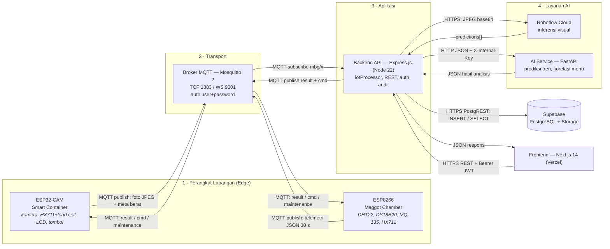
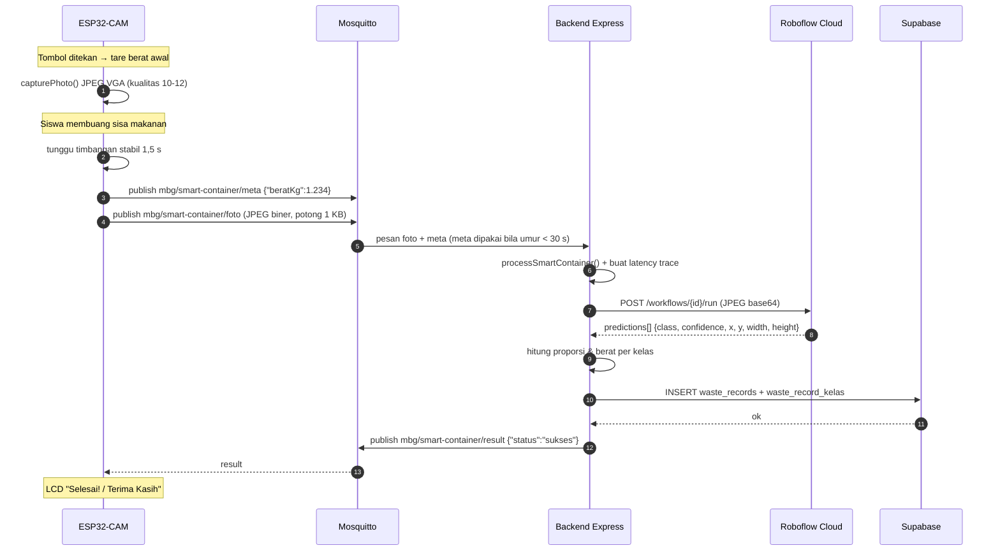
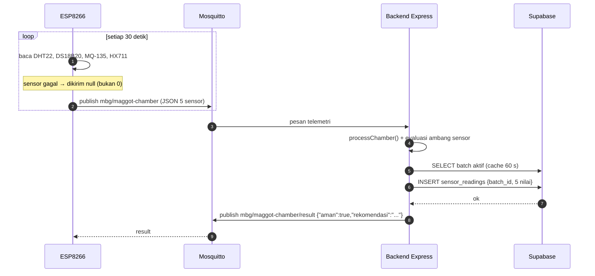
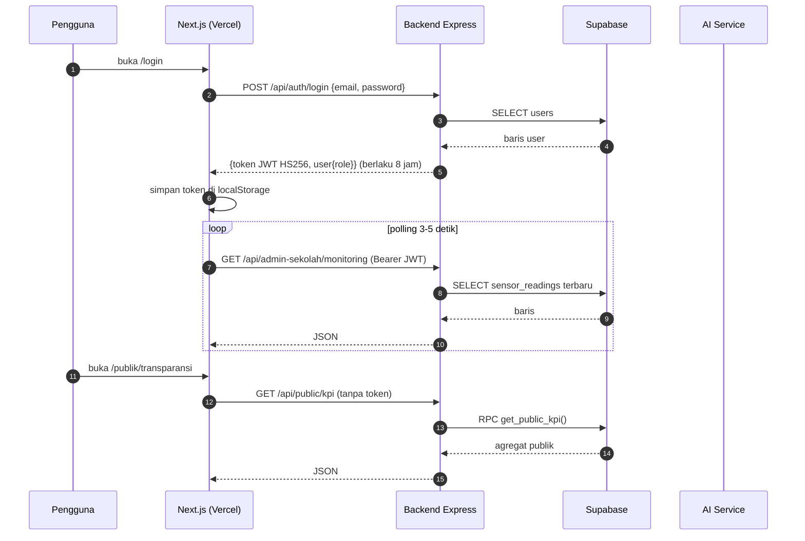

# Flowchart Arsitektur dan Alur Data AIoT — MBGCircular

Dokumen ini menjawab tiga pertanyaan sekaligus:

1. **Koneksinya kemana saja** — komponen apa menghubungi komponen apa.
2. **Protokol apa yang dipakai** — MQTT, HTTP/HTTPS, WebSocket, atau I2C/OneWire di sisi sensor.
3. **Data apa yang dikirim** — bentuk payload nyata pada setiap hop.

Diagram siap-tempel untuk laporan/slide ada di:

| Berkas | Keterangan |
|---|---|
| `docs/flowchart-arsitektur-aiot.svg` | Diagram vektor (bisa diperbesar tanpa pecah) |
| `docs/flowchart-arsitektur-aiot.png` | Ekspor PNG resolusi tinggi untuk slide/paper |
| `docs/flowchart-arsitektur-aiot.mmd` | Sumber Mermaid untuk dirender ulang/diedit |

---

## 1. Ringkasan alur

```
ESP32-CAM  ──publish──┐
                      ├──► Mosquitto (MQTT/TCP 1883) ──► Backend Express ──┬──► Supabase (PostgreSQL)
ESP8266    ──publish──┘                                    ▲                └──► Layanan AI
                                                           │
                                          Frontend Next.js ┘  (HTTPS REST + JWT)
```

Poin penting yang membedakan sistem ini dari arsitektur IoT umum:

- **Tidak ada ThingsBoard.** Monitoring perangkat, status online, dan kontrol
  diimplementasikan sendiri di `backend/src/config/deviceRegistry.js`.
- **Inferensi visual dijalankan di server, bukan on-device.** ESP32-CAM hanya
  memotret dan mengirim JPEG; klasifikasi dilakukan Roboflow dari backend.
- **Satu-satunya penulis database adalah backend.** AI Service dan frontend tidak
  pernah menyentuh Supabase secara langsung.
- **Perangkat tidak pernah memanggil HTTP backend.** Transport produksi adalah
  MQTT dua arah; endpoint REST `/api/iot/*` hanya fallback untuk pengujian `curl`.

---

## 2. Diagram alur (Mermaid)



---

## 3. Urutan pesan per alur

### 3.1 Smart Container — dari tombol sampai LCD "Selesai"



### 3.2 Maggot Chamber — telemetri periodik



### 3.3 Frontend — dashboard dan dashboard publik



---

## 4. Tabel protokol dan port

| # | Dari → Ke | Protokol | Port | Autentikasi | Data yang lewat |
|---|---|---|---|---|---|
| 1 | ESP32-CAM / ESP8266 → Mosquitto | **MQTT 3.1.1 di atas TCP** | 1883 | username + password (kredensial perangkat) | foto JPEG biner, meta berat, telemetri JSON, status |
| 2 | Mosquitto → perangkat (balik) | **MQTT 3.1.1** | 1883 | sama | `result`, `cmd`, `maintenance` (retained) |
| 3 | Mosquitto ⇄ Backend | **MQTT 3.1.1** | 1883 | username + password backend | subscribe `mbg/#`, publish result & perintah |
| 4 | Backend → Supabase | **HTTPS (PostgREST via supabase-js)** | 443 | `SUPABASE_SERVICE_ROLE_KEY` (bypass RLS) | INSERT/SELECT/UPDATE seluruh tabel |
| 5 | Backend → Roboflow | **HTTPS REST** | 443 | header `Authorization: <API key>` | kirim base64 JPEG, terima `predictions[]` |
| 6 | Backend → AI Service | **HTTP (jaringan internal Docker)** | 8000 | header `X-Internal-Key` | JSON riwayat mingguan, terima JSON analisis |
| 7 | Frontend → Backend | **HTTPS REST (JSON)** | 443 via Caddy | `Authorization: Bearer <JWT>`; `/api/public/*` tanpa token | request JSON, respons JSON |
| 8 | Mosquitto → klien WebSocket | MQTT over WebSocket | 9001 | username + password | disediakan konfigurasi, belum dipakai frontend |
| 9 | Sensor → MCU (di dalam perangkat) | I2C (LCD), OneWire (DS18B20), ADC (MQ-135), pulsa HX711 | — | — | bukan jaringan, hanya kabel |

> **Catatan port.** Port 1883 sengaja diekspos publik karena perangkat lapangan
> terhubung dari internet. Port 4000 (backend), 8000 (AI service), dan 5432
> (PostgreSQL) **tidak** diekspos; hanya Caddy pada 80/443 yang menghadap publik.

---

## 5. Topik MQTT dan payload

Prefix default `mbg` (`MQTT_TOPIC_PREFIX` di backend, `MQTT_PREFIX` di firmware).

| Topik | Arah | Retained | Payload |
|---|---|---|---|
| `mbg/smart-container/meta` | perangkat → broker | tidak | `{"beratKg":1.234}` |
| `mbg/smart-container/foto` | perangkat → broker | tidak | **byte JPEG mentah** (bukan base64), VGA 640×480, dikirim bertahap 1024 byte |
| `mbg/smart-container/result` | backend → perangkat | tidak | `{"status":"sukses","message":"Selesai! Terima Kasih","totalBeratKg":1.234,"mode":"roboflow","tersimpan":true,"deteksi":[{"kelas":"nasi","kategori":"nasi","beratKg":0.62,"proporsi":50.2,"confidence":0.91}]}` |
| `mbg/smart-container/status` | perangkat → broker | tidak | heartbeat tiap 60 s: `{"perangkat":"smart-container","heartbeat":true,"beratKg":1.23,"scaleFaktor":450.0,"uptimeMs":123456}` · hasil perintah: `{"perangkat":"smart-container","cmd":"tare","ok":true,"scaleFaktor":450.0}` |
| `mbg/smart-container/cmd` | backend → perangkat | tidak | `{"cmd":"tare"}` · `{"cmd":"set_scale_factor","value":450}` · `{"cmd":"status"}` · `{"cmd":"reboot"}` |
| `mbg/maggot-chamber` | perangkat → broker | tidak | `{"batchId":"","suhuBilikC":29.4,"kelembabanPersen":71.2,"kadarAmoniaPpm":12.5,"suhuSubstratC":31.0,"beratMaggotPanenKg":0.842}` — nilai jadi `null` bila sensor gagal dibaca |
| `mbg/maggot-chamber/result` | backend → perangkat | tidak | `{"aman":true,"rekomendasi":"Suhu dan kelembapan dalam rentang aman.","tersimpan":true,"ambangConfidence":0.4}` |
| `mbg/maggot-chamber/status` | perangkat → broker | tidak | `{"perangkat":"maggot-chamber","scaleFaktor":450.0,"mq135R0":30.0}` (juga dipakai melaporkan hasil `cmd`) |
| `mbg/maggot-chamber/cmd` | backend → perangkat | tidak | `{"cmd":"tare"}` · `{"cmd":"set_scale_factor","value":450}` · `{"cmd":"set_r0","value":30}` · `{"cmd":"set_interval","value":30000}` · `{"cmd":"status"}` · `{"cmd":"reboot"}` |
| `mbg/maintenance` | backend → semua perangkat | **ya** | `{"aktif":false}` — retained, sehingga perangkat yang baru terhubung langsung menerima state terakhir |

**Karakteristik transport:** semua pesan MQTT memakai QoS 0 dan `retain=false`
(kecuali `mbg/maintenance`). Ukuran buffer: 4096 byte (ESP32-CAM), 512 byte
(ESP8266) — karena itu foto harus dipotong menjadi bagian 1 KB.

---

## 6. Endpoint REST dan payload

### 6.1 Frontend → Backend (`NEXT_PUBLIC_API_URL`, default `http://localhost:4000/api`)

| Endpoint | Metode | Token | Data |
|---|---|---|---|
| `/auth/login` | POST | — | `{email, password}` → `{token, user{id,nama,role,email}}` |
| `/public/kpi` | GET | — | agregat `totalLimbahTerolahKg`, `totalPanenMaggotKg`, `penghematanEmisiCo2e` |
| `/public/waste-by-category` | GET | — | agregat per kategori |
| `/public/tren?periode=hari\|minggu` | GET | — | deret waktu berat limbah |
| `/public/kualitas-data` | GET | — | cakupan/provenance data |
| `/public/peringkat-kategori` | GET | — | peringkat kategori terbuang |
| `/admin-sekolah/monitoring` | GET | JWT | telemetri + status perangkat |
| `/admin-sekolah/menu` | GET/POST | JWT | unggah menu MBG (multipart, foto ke bucket `menu-foto`) |
| `/admin-sekolah/penjualan` | GET/POST | JWT | catatan penjualan maggot |
| `/admin-sekolah/batches` | GET/POST/PUT | JWT | siklus batch maggot, `PUT /:id/panen` |
| `/dapur-mbg/korelasi-menu` | GET | JWT | hasil AI korelasi menu |
| `/dapur-mbg/efisiensi` | GET | JWT | efisiensi konversi limbah |
| `/dapur-mbg/analisis-sisa` | GET | JWT | analisis sisa per kelas |
| `/devices` | GET | JWT | status perangkat dari deviceRegistry |
| `/devices/:id/cmd` | POST | JWT + rate limit | `{cmd, value}` → diteruskan ke `mbg/<id>/cmd` |
| `/demo/toggle`, `/iot/maintenance-mode` | POST | JWT (superadmin) | `{aktif}` → disimpan di `system_state` + dipublikasikan retained |
| `/reports/csv` | GET | JWT | ekspor CSV |
| `/kinerja`, `/audit` | GET | JWT (superadmin) | statistik latency dan jejak audit |

### 6.2 Perangkat → Backend (fallback REST, bukan jalur produksi)

| Endpoint | Metode | Auth | Data |
|---|---|---|---|
| `/api/iot/smart-container` | POST | `DEVICE_API_KEY` atau JWT admin | `multipart/form-data`: `foto` (JPEG ≤ 8 MB) + `beratKg` |
| `/api/iot/maggot-chamber` | POST | `DEVICE_API_KEY` atau JWT admin | JSON 5 sensor yang sama dengan topik MQTT |

Batas body: 256 KB untuk `/api/iot/*`, 1 MB untuk endpoint JSON lain, 8 MB untuk
unggahan foto. Balasan: `400` payload cacat, `422` payload sah tetapi seluruh
nilai sensor kosong, `500`/`503` kegagalan simpan.

---

## 7. Koneksi database

**Supabase (PostgreSQL + Storage)** — diakses backend lewat HTTPS 443 memakai
`SUPABASE_URL` + `SUPABASE_SERVICE_ROLE_KEY`. Row Level Security aktif, dan
kebijakan `service_role` memberi akses penuh; frontend memakai anon key hanya
bila nanti mengakses Supabase langsung (saat ini semua lewat backend).

| Tabel | Ditulis oleh | Dipakai untuk |
|---|---|---|
| `users` | seed / admin | akun + role (`superadmin`, `admin_sekolah`, `dapur_mbg`) |
| `maggot_batches` | admin sekolah | siklus batch (status `inkubasi`, `aktif_makan`, `siap_panen`, `selesai_panen`) |
| `sensor_readings` | **iotProcessor.processChamber** | telemetri DHT22/DS18B20/MQ-135/HX711 + `batch_id` |
| `waste_records` | **iotProcessor.processSmartContainer** | satu baris per kelas per sesi penimbangan + provenance (`sumber`, `is_simulated`, `estimasi_mode`, `model_versi`, `confidence_rata_rata`, `skema_berat`) |
| `waste_record_kelas` | **iotProcessor.processSmartContainer** | rincian per kelas dalam satu `sesi_id` (proporsi, confidence, luas piksel) |
| `menu_uploads` | admin sekolah | menu MBG harian + `foto_url` di Storage |
| `maggot_harvests` | admin sekolah | hasil panen maggot |
| `sales_records` | admin sekolah | penjualan maggot (segar/kering) |
| `ai_predictions` | backend | simpan hasil prediksi AI Service |
| `food_density` | migrasi/seed | acuan densitas relatif per kelas (kalibrasi `densitas_v2`) |
| `system_state` | backend | mode demo & mode pemeliharaan agar bertahan lintas deploy |
| `audit_log` | backend | jejak audit tindakan operator (perintah perangkat, toggle mode) |
| `schema_migrations` | migrasi | penanda versi skema |
| Storage bucket `menu-foto` | backend | foto menu MBG |
| Fungsi `get_public_kpi()` | — | agregat dashboard publik, mengecualikan data simulasi |

---

## 8. Konfigurasi koneksi (variabel lingkungan)

| Variabel | Dipakai oleh | Menentukan koneksi ke |
|---|---|---|
| `SUPABASE_URL`, `SUPABASE_SERVICE_ROLE_KEY` | backend | Supabase (HTTPS 443) |
| `NEXT_PUBLIC_SUPABASE_URL`, `NEXT_PUBLIC_SUPABASE_ANON_KEY` | frontend | Supabase (belum dipakai aktif) |
| `MQTT_URL`, `MQTT_USERNAME`, `MQTT_PASSWORD`, `MQTT_TOPIC_PREFIX` | backend | Broker Mosquitto |
| `SECRET_MQTT_SERVER`, `SECRET_MQTT_PORT`, `SECRET_MQTT_USER`, `SECRET_MQTT_PASS`, `SECRET_MQTT_PREFIX` | firmware (`secrets.h`) | Broker Mosquitto |
| `SECRET_WIFI_SSID`, `SECRET_WIFI_PASS` | firmware | Akses internet 2,4 GHz |
| `ROBOFLOW_API_KEY`, `ROBOFLOW_WORKFLOW_ID` atau `ROBOFLOW_MODEL` | backend | Roboflow Cloud (HTTPS 443) |
| `AI_SERVICE_URL`, `AI_INTERNAL_KEY` | backend | AI Service FastAPI |
| `AI_INTERNAL_KEY`, `AI_REQUIRE_AUTH` | ai_service | Memvalidasi pemanggil |
| `JWT_SECRET` | backend | Penandatanganan token frontend |
| `DEVICE_API_KEY` | backend | Autentikasi fallback endpoint `/api/iot/*` |
| `FRONTEND_ORIGIN`, `ALLOWED_EXTRA_ORIGINS` | backend | Daftar origin CORS yang diizinkan |
| `NEXT_PUBLIC_API_URL` | frontend | Alamat backend |

---

## 9. Catatan dan batasan yang perlu diketahui

- **Broker belum memakai `acl_file`.** Satu kredensial MQTT dapat mengakses topik
  perintah semua perangkat. Tercatat sebagai temuan keamanan berprioritas tinggi.
- **Transport produksi perangkat adalah MQTT, bukan HTTP.** Port 1883 terbuka;
  keamanan bergantung pada kredensial perangkat.
- **Foto tidak disimpan ke Storage.** Yang masuk database adalah hasil deteksi
  (kelas, proporsi, berat, confidence). Foto hanya lewat di memori backend.
- **Hasil mode `mock` tidak disimpan** (`MOCK_ALLOW_PERSIST=false`), sehingga
  kegagalan Roboflow tidak diam-diam menjadi data produksi.
- **AI Service tidak membaca database.** Backend yang menarik riwayat dari
  Supabase lalu mengirimkannya sebagai JSON, sehingga AI Service tetap stateless.
- **Tidak ada akses langsung frontend → perangkat.** Semua perintah melewati
  backend, dicatat di `audit_log`, lalu diteruskan sebagai pesan MQTT.
- **Diagram lama `docs/flowchart-arsitektur-thingsboard.svg` sudah usang** karena
  menyebut ThingsBoard dan memisahkan load cell sebagai perangkat tersendiri.
  Gunakan `flowchart-arsitektur-aiot.*` sebagai acuan.

Dokumen terkait: `README.md` (arsitektur ringkas), `firmware/WIRING_PINOUT.md`
(pinout dan skema topik), `docs/DEPLOY_PRODUCTION.md` (langkah deploy),
`docs/AUDIT_PRODUCTION_READINESS.md` (temuan per layer).
